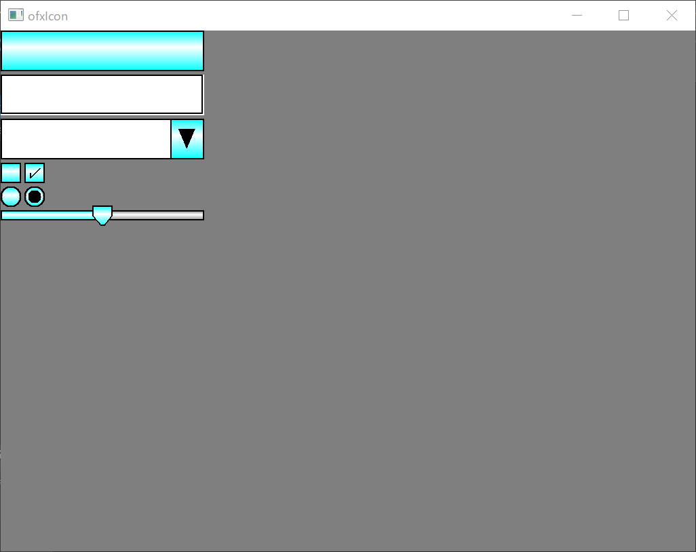

ofxIcon
=====================================

ofxIcon is icon generator for game ui.


Introduction
------------
ofxIcon is icon generator for game ui.
first screen shot is generated by bellow code.

````
void ofApp::setup(){
	ofPixels pix;
	pix.allocate(300, 60, ofImageType::OF_IMAGE_COLOR_ALPHA);
	ofxIcon::writeButtonImage(pix, ofxIcon::ButtonStyle());
	buttonImage.setFromPixels(pix);

	ofPixels pix2;
	pix2.allocate(300, 60, ofImageType::OF_IMAGE_COLOR_ALPHA);
	ofxIcon::writeInputFieldImage(pix2, ofxIcon::InputFieldStyle());
	inputFieldImage.setFromPixels(pix2);

	ofPixels pix3;
	pix3.allocate(300, 60, ofImageType::OF_IMAGE_COLOR_ALPHA);
	ofxIcon::writeDropdownImage(pix3, ofxIcon::DropdownStyle());
	dropdownImage.setFromPixels(pix3);

	ofPixels pix4;
	pix4.allocate(30, 30, ofImageType::OF_IMAGE_COLOR_ALPHA);
	ofxIcon::writeCheckBoxImage(pix4, ofxIcon::CheckBoxStyle());
	checkboxImage.setFromPixels(pix4);

	ofPixels pix5;
	pix5.allocate(30, 30, ofImageType::OF_IMAGE_COLOR_ALPHA);
	ofxIcon::writeCheckBoxImage(pix5, ofxIcon::CheckBoxStyle().selected(true));
	checkboxImage2.setFromPixels(pix5);

	ofPixels pix6;
	pix6.allocate(30, 30, ofImageType::OF_IMAGE_COLOR_ALPHA);
	ofxIcon::writeRadioButtonImage(pix6, ofxIcon::RadioButtonStyle());
	radioButtonImage.setFromPixels(pix6);

	ofPixels pix7;
	pix7.allocate(30, 30, ofImageType::OF_IMAGE_COLOR_ALPHA);
	ofxIcon::writeRadioButtonImage(pix7, ofxIcon::RadioButtonStyle().selected(true));
	radioButtonImage2.setFromPixels(pix7);

	ofPixels pix8;
	pix8.allocate(300, 15, ofImageType::OF_IMAGE_COLOR_ALPHA);
	ofxIcon::writeSliderImage(pix8, ofxIcon::SliderStyle());
	sliderImage.setFromPixels(pix8);

	ofPixels pix9;
	pix9.allocate(300, 15, ofImageType::OF_IMAGE_COLOR_ALPHA);
	ofxIcon::writeSliderImage(pix9, ofxIcon::SliderStyle().fillColor0(ofColor::gray).fillColor1(ofColor::white).fillColor2(ofColor::gray));
	sliderImage2.setFromPixels(pix9);

	ofPixels pix10;
	pix10.allocate(30, 30, ofImageType::OF_IMAGE_COLOR_ALPHA);
	ofxIcon::writeSliderKnobImage(pix10, ofxIcon::SliderKnobStyle());
	sliderKnobImage.setFromPixels(pix10);

	ofSetBackgroundColor(ofColor::gray);
}
````

License
-------
MIT License

Installation
------------
this folder into the `openFrameworks/addons/` folder.

Dependencies
------------
have no dependencies.

Compatibility
------------
* of_v0.10.1_vs2017_release
* Windows10

Known issues
------------
known problem is none.

Version history
------------


### Version 0.1 (2020/02/12):
first release

### Version 0.2 (2020/02/12):
* added a bellow members:
  * DropdownStyle#_minSlotWidth
  * DropdonwStyle#_maxSlotWidth
  * DropdownStyle#minSlotWidth(int _minSlotWidth);
  * DropdownStyle#maxSlotWidth(int _maxSlotWidth);
  * DropdownStyle#computeSlotWidth(int width) const;

### Version 0.3 (2020/02/14):
* added a slider generate function